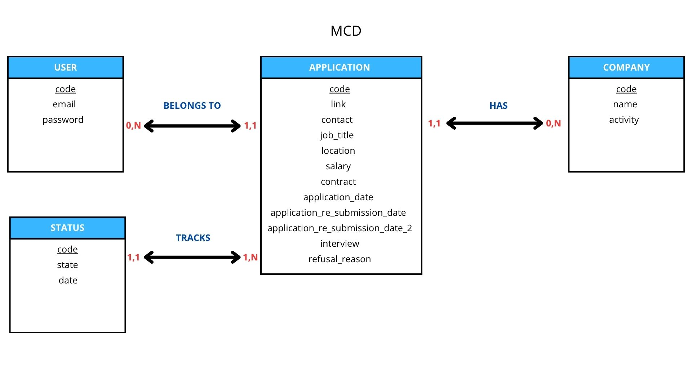

# MCD — Tracker de candidatures

Le modèle conceptuel de données repose sur 4 entités :

- **User** (`code`, `email`, `password`) : un utilisateur du tracker.
- **Company** (`code`, `name`, `activity`) : une entreprise, isolée dans sa propre entité pour éviter de dupliquer son nom et son secteur d'activité à chaque candidature qui la concerne.
- **Application** (`code`, `link`, `contact`, `job_title`, `location`, `salary`, `contract`, `application_date`, `application_re_submission_date`, `application_re_submission_date_2`, `interview`, `refusal_reason`) : une candidature, avec ses informations propres (le lieu du poste, les dates de relance, l'entretien obtenu, la raison de refus...).
- **Status** (`code`, `state`, `date`) : un changement d'état horodaté, pour conserver l'historique complet d'une candidature plutôt qu'un simple statut courant.

Relations et cardinalités :

- **User (0,N) BELONGS TO Application (1,1)** : un user peut avoir 0 à N candidatures ; une candidature appartient à exactement un user.
- **Application (1,1) HAVE Company (0,N)** : une candidature référence exactement une entreprise ; une entreprise peut être associée à 0 à N candidatures.
- **Status (1,1) DESCRIBES Application (1,N)** : un statut décrit exactement une candidature ; une candidature possède 1 à N statuts (au minimum le statut initial à sa création).

