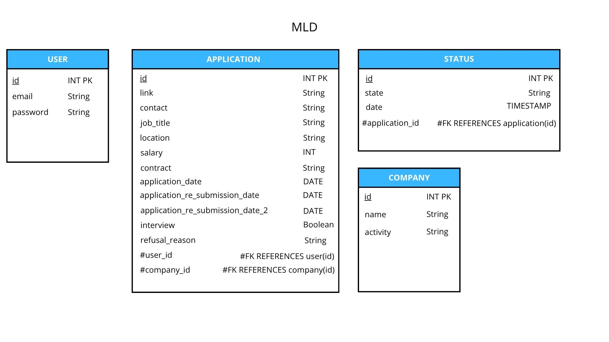

# MLD — Tracker de candidatures

Le modèle logique de données traduit le MCD en 4 tables reliées par des clés étrangères.

- **USER** (`id` INT PK, `email` String, `password` String).
- **COMPANY** (`id` INT PK, `name` String, `activity` String).
- **APPLICATION** (`id` INT PK, `link`, `contact`, `job_title`, `location`, `contract`, `refusal_reason` en String, `salary` en INT, `application_date`, `application_re_submission_date`, `application_re_submission_date_2` en DATE, `interview` en Boolean, `#user_id` FK vers `user(id)`, `#company_id` FK vers `company(id)`).
- **STATUS** (`id` INT PK, `state` String, `date` en TIMESTAMP, `#application_id` FK vers `application(id)`).

Placement des clés étrangères et choix de types, en cohérence avec les cardinalités du MCD :

- `APPLICATION.user_id` et `APPLICATION.company_id` : la clé étrangère est placée côté `Application` car ses cardinalités face à `User` et `Company` sont **1,1** (une candidature référence exactement un seul user et une seule entreprise).
- `STATUS.application_id` : même logique, `Status` est en **1,1** face à `Application`.
- `STATUS.date` en **TIMESTAMP** (et non simple `DATE`) : une candidature peut changer de statut plusieurs fois au cours d'une même journée, il faut donc pouvoir les distinguer par l'heure exacte, pas seulement le jour.
- Les dates dans `APPLICATION` (candidature, relances) en **DATE** : ce sont des dates fixes, la précision au jour suffit.

